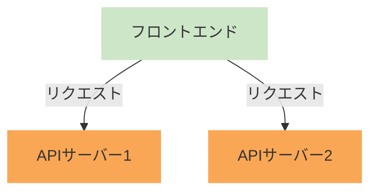
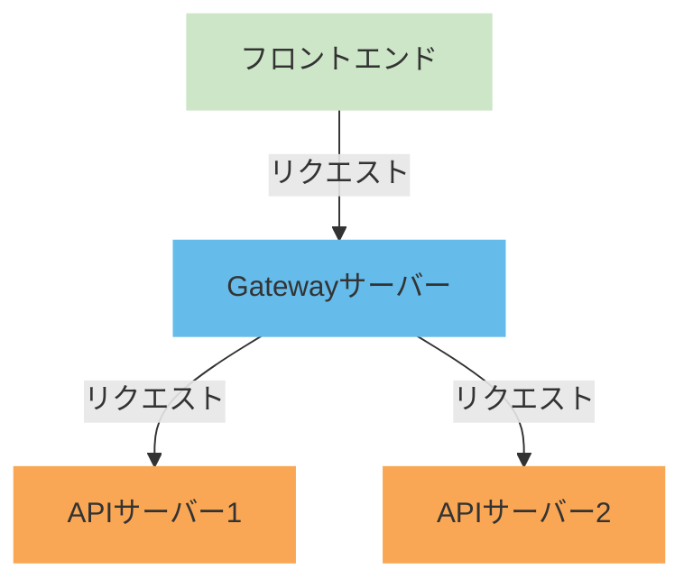

# はじめに
こんにちはたくみです．

「今年最も大きなチャレンジ」ということで，RestAPIからGraphQLの移行や，認証基盤システムのインフラ構築，AppRouterのContainer／Presentation構成の移行など様々思い浮かびますが，一番困難だったのは「Graphql Federation」の導入かなと思います．
ただ，Graphql Federationを導入すると，今までのGraphQLには戻れない体になってしまい，マイクロサービスアーキテクチャの虜になってしまいました笑

この記事では実際に導入したときの手順と困難を紹介します．

誰かのお役に立てたら幸いです．

# 概要
### 従来
現在のSaaSプロダクトは，サービスごとに別れているマイクロサービスアーキテクチャとなっています．
しかし，APIサーバー（バックエンド）もサービスごとに別れてしまっており，サービス間のデータのやり取りで，複数のエンドポイントにリクエストを送っている感じになっていました．
:::details 従来のアーキテクチャ図（簡略）

:::

マイクロサービスアーキテクチャをしているなら，APIサーバーをまとめ上げたほうが，エンドポイントが１つになり，フロントエンドから見るととてもわかり易くなりそうですよね．
また，APIサーバーが別れていることから，複数のサービスからデータを取得してきて，それをフロントエンドで合体させて使用する形になっていました．
データの取得や変形は極力バックエンドに任せたいところなのですが，サーバーが別れているためどうしようにもありませんでした…

### GraphQL Federation
ここで出てきたのが「GraphQL Federation」という技術です．
GraphQL Federationは，Gatewayサーバーを用意しておき，フロントエンドからはGatewayサーバーのエンドポイントを叩くことで，Gatewayサーバーがバックエンドにリクエストを伝搬してデータを返してくれると言ったものになります．
また，それだけでなく，クエリによって各サービスのデータを合体させて返すため，フロントエンド側での処理も少なくなります！
:::details GraphQL Federationのアーキテクチャ図（簡略）

:::

この技術を使用すれば，従来の困っていた点を解決させることができるため，導入の流れになりました．

https://www.apollographql.com/docs/graphos/schema-design/federated-schemas/federation
