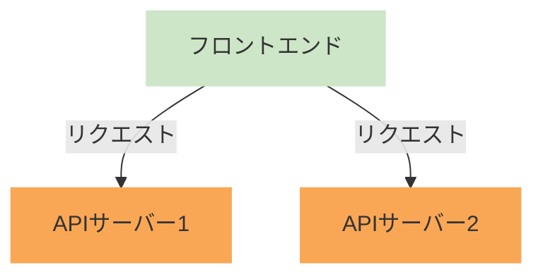
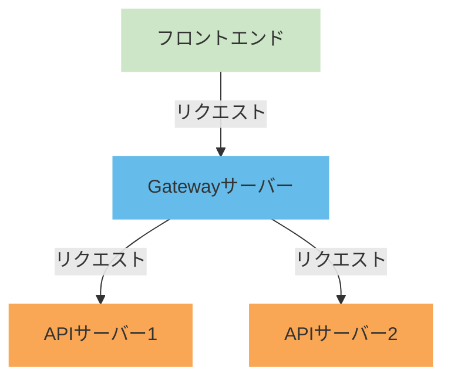
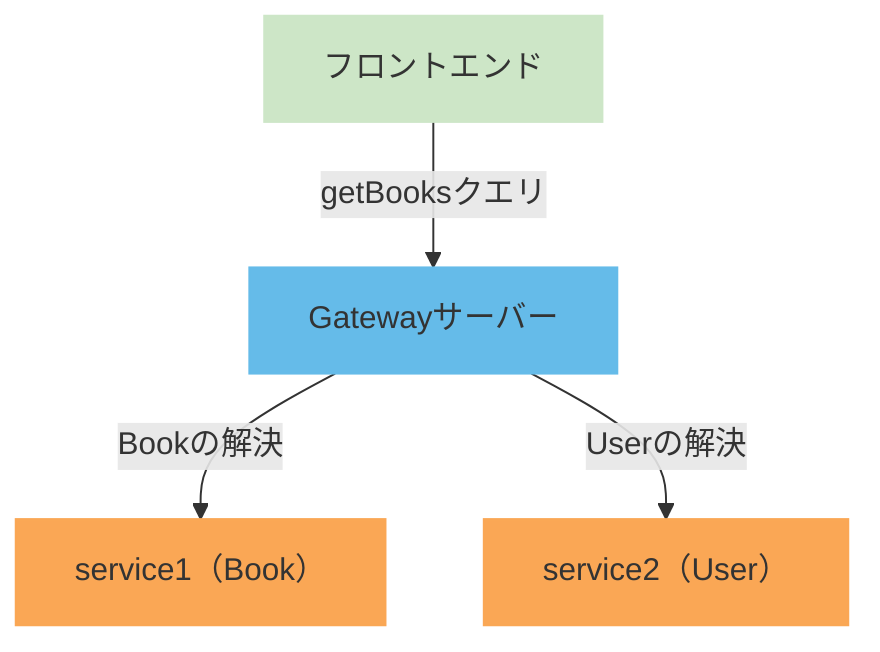

# はじめに
こんにちは，たくみです．

「今年最も大きなチャレンジ」ということで，RestAPIからGraphQLの移行や，認証基盤システムのインフラ構築，AppRouterのContainer／Presentation構成の移行など様々思い浮かびますが，一番困難だったのは「Graphql Federation」の検証かなと思います．
ただ，Graphql Federationを理解すると，今までのGraphQLには戻れない体になってしまい，マイクロサービスアーキテクチャの虜になってしまいました笑

この記事では実際に検証したときの手順と困難を紹介します．

誰かのお役に立てたら幸いです．

:::message
この記事では検証やデバッグの工程は省略しており，検証（導入）のまとめとなっています．
あと長いです．読み飛ばすなり，ほしい部分だけを読むなりしてください．
:::

# 環境
### 全体
- bun v1.1.42
### Gatewayサーバー
- express v4.17.2
- Apollo Server v4.11.0
- Apollo Gateway v2.7.8
### 各APIサーバー
- express v4.17.2
- Apollo Server v4.11.0

# 概要
### 従来
現在のSaaSプロダクトは，サービスごとに分かれているマイクロサービスアーキテクチャとなっています．
しかし，APIサーバー（バックエンド）もサービスごとに別れてしまっており，サービス間のデータのやり取りで，複数のエンドポイントにリクエストを送っている感じになっていました．
:::details 従来のアーキテクチャ図（簡略）

:::

マイクロサービスアーキテクチャをしているなら，APIサーバーをまとめ上げたほうが，エンドポイントが１つになり，フロントエンドから見るととてもわかり易くなりそうですよね．
また，APIサーバーが別れていることから，複数のサービスからデータを取得してきて，それをフロントエンドで合体させて使用する形になっていました．
データの取得や変形は極力バックエンドに任せたいところなのですが，サーバーが別れているためどうしようにもありませんでした…

### GraphQL Federation
ここで出てきたのが「GraphQL Federation」という技術です．
GraphQL Federationは，Gatewayサーバーを用意しておき，フロントエンドからはGatewayサーバーのエンドポイントを叩くことで，Gatewayサーバーがバックエンドにリクエストを伝搬してデータを返してくれると言ったものになります．
また，それだけでなく，クエリによって各サービスのデータを合体させて返すため，フロントエンド側での処理も少なくなります！
:::details GraphQL Federationのアーキテクチャ図（簡略）

:::

この技術を使用すれば，従来の困っていた点を解決させることができるため，導入の流れになりました．

https://www.apollographql.com/docs/graphos/schema-design/federated-schemas/federation

# 構築の流れ（手順）
## 1. 各APIサーバーの準備
### 1-1．APIサーバーのGraphQL化
今までのAPIサーバーでは，GraphQLで作成されているものとREST APIで作成されているものが混ざり合っていました．
このままでは，GraphQL Federationを導入することができないため，まずはAPIサーバーをGraphQL化する必要があります．
ここのGraphQL化は，使用している言語やフレームワークによって異なるので，それぞれの公式ドキュメントを参考にしてください．
### ex） Express.js
https://graphql.org/graphql-js/running-an-express-graphql-server/
### ex） NestJS
https://docs.nestjs.com/graphql/quick-start

### 1-2．APIサーバーのFederation対応
APIサーバーをGraphQL化したら，次にFederationに対応させるようコードを修正します．
これも各フレームワークによって異なりますが，Apollo Serverを使用している場合は，以下のように修正します．
:::details コード例
#### パッケージのインストール
```bash
bun add http graphql-tag @apollo/subgraph @apollo/server cors express
bun add -D @types/cors
```

```ts:packages/user,book/src/index.ts
import http from "http";

import { gql } from "graphql-tag";
import { buildSubgraphSchema } from "@apollo/subgraph";
import { ApolloServer } from "@apollo/server";
import { expressMiddleware } from "@apollo/server/express4";
import { ApolloServerPluginDrainHttpServer } from "@apollo/server/plugin/drainHttpServer";
import cors from "cors";
import express from "express";

const app = express();
const httpServer = http.createServer(app);

const typeDefs = gql`
    type Query {
        hello: String!
    }
`;

const resolvers = {
    Query: {
        hello: () => "Hello, World!",
    },
};

const server = new ApolloServer({
    /* ここを `buildSubgraphSchema` に変える */
    schema: buildSubgraphSchema([
        {
            typeDefs,
            resolvers,
        },
    ]),
    plugins: [ApolloServerPluginDrainHttpServer({ httpServer })],
});

(async () => {
    await server.start();

    app.use(
        "/graphql",
        cors<cors.CorsRequest>();
        express.json(),
        expressMiddleware(server, {
            context: async ({ req }) => {
                return { headers: req.headers };
            },
        })
    );

    await new Promise<void>((resolve) => httpServer.listen({ port: 4000 }, resolve));
    console.log("Server ready at 4000 port");
})();
```
:::

## 2. GraphQL Federation Gatewayサーバーの作成
すべてのAPIサーバーをGraphQL化したら，早速Federation用のGatewayサーバーを作成します．
ここで，GatewayサーバーはApollo ServerとApollo Gatewayを使用しました．
https://www.apollographql.com/docs/apollo-server
https://www.apollographql.com/docs/federation/v1/gateway

### 2-1. 各モジュールのインストール
```bash
bun add @apollo/server @apollo/gateway express cors http
bun add -D @types/cors
```

### 2-2．index.tsの作成
`index.ts`にGatewayサーバーを実装していきます．
:::details コード例
```typescript:packages/gateway/src/index.ts
import http from "http";

import { ApolloGateway, IntrospectAndCompose } from "@apollo/gateway";
import { ApolloServer } from "@apollo/server";
import { expressMiddleware } from "@apollo/server/express4";
import { ApolloServerPluginDrainHttpServer } from "@apollo/server/plugin/drainHttpServer";
import cors from "cors";
import express from "express";

const app = express();
const httpServer = http.createServer(app);

const serviceList = [
    { name: "user", url: "http://localhost:5001/graphql" },
    { name: "book", url: "http://localhost:5002/graphql" },
];

const gateway = new ApolloGateway({
    supergraphSdl: new IntrospectAndCompose({
        subgraphs: serviceList,
    }),
})

const server = new ApolloServer({
    gateway,
    plugins: [ApolloServerPluginDrainHttpServer({ httpServer })],
});

(async () => {
    await server.start();

    app.use(
        "/graphql",
        cors<cors.CorsRequest>(),
        express.json(),
        expressMiddleware(server, {
            context: async ({ req }) => {
                return { headers: req.headers };
            },
        })
    );

    await new Promise<void>((resolve) => httpServer.listen({ port: 5000 }, resolve));
    console.log("Server ready at 5000 port");
})();
```
:::

### 2-3. Gatewayサーバーの起動
`index.ts`が完成したら実際に動かしてみましょう．
なお，Gatewayサーバー起動の際は各APIサーバーも起動しておいてください．
```bash
bun --watch packages/gateway/src/index.ts
```

:::details 各APIサーバーも起動する理由
ここで下記のようなエラーが発生する場合があります．
```bash
Service definition for service service1 is missing a url
/workspace/node_modules/@apollo/gateway/src/supergraphManagers/IntrospectAndCompose/loadServicesFromRemoteEndpoint.ts:32
const promiseOfServiceList = serviceList.map(async ({ name, url, datasource }) => {

Error: Tried to load schema for 'Service1' but no 'url' was specified.
```

エラーが出ても焦らないでください．よく読めばわかります．
`service definition is missing a url`と出ているので，service1に対するurlが見つからないと言われていることがわかります．

実はGatewayサーバーは，**スーパーグラフ**（すべてのGraphQLのスキーマを統合したスキーマ）を作成するために，起動時に各APIサーバーへリクエストを送ります．
しかし，現在，`https://localhost:5001/graphql`は起動されていないので，Gatewayサーバーはリクエストを送ることができません．

このエラーが出た場合は，各APIサーバーを起動してからGatewayサーバーを起動してください．
:::

# 3．動作確認
実は，ここまででGraphQL Federationの導入は完了しています．
Gatewayサーバーのエンドポイントにリクエストを送ることで，各APIサーバーのデータを取得することができます．
```bash:リクエスト
curl --request POST \
  --header 'content-type: application/json' \
  --url 'http://localhost:5000/graphql' \
  --data '{"query":"query { hello }"}'
```

```bash:レスポンス
{
  "data": {
    "hello": "Hello, World!"
  }
}
```

# 4. サービス間のデータのやり取り
ここまででGraphQL Federationの導入は完了しましたが，サービス間のデータのやり取りができるよう各APIサーバーのスキーマやリゾルバーを修正します．
## 4-1．具体例
具体例があったほうがわかりやすいので，次のようなアーキテクチャを考えてみます．
- service1：本の情報を提供するAPIサーバー
- service2：ユーザーの情報を提供するAPIサーバー
```graphql:service1（Book）のスキーマ
type Book {
    id: ID!
    title: String!
    author: User!
}

query {
    getBooks: [Book]!
}
```
```graphql:service2（User）のスキーマ
type User {
    id: ID!
    name: String!
}
```


## 4-2．スキーマの修正
まずは設計図であるスキーマの修正をしながら具体例を整理していきましょう．
### 4-2-1．service1（Book）のスキーマ
service1のスキーマは以下の通りとなります．
```graphql:service1のスキーマ
type Book {
    id: ID!
    title: String!
}

query {
    getBooks: [Book]!
}
```
あれ？`author`がないと思った方もいると思います．
service1のスキーマには`author`がないのは，`author`はservice2でしか解決できない（データを持っていない）フィールドなので，service1のスキーマには含めずません．

### 4-2-2．service2（User）のスキーマ
service2のスキーマは以下の通りとなります．
```graphql:service2のスキーマ
type User {
    id: ID!
    name: String!
}

extend type Book @key(fields: "id") {
    id: ID! @external
    author: User!
}
```
ここで，`author`が出てきました！通常のGraphQLでは使われない`@key`や`@external`が出てきましたが，これはFederationのためのディレクティブです．
#### `@key`：この型が他の型と関連付けられるキーを指定します．
  DBでいうところの主キーに値するフィールドになります．
  ここで指定したフィールドをキーとして，外部から参照できるようになります．
  ここでは，`Book`をUserという別サービスで使用しているため，`Book`にのみ`@key`を指定しています．
#### `extend type`：外部の型を拡張するためのディレクティブです．
  他のサービスで解決される型を拡張し，新たなフィールドを追加することができます．
  ここでは，`Book`型を拡張して，`author`フィールドを追加しています．
#### `@external`：他のサービスから解決されるフィールドを指定します．
  ここで指定したフィールドは，他のサービスから取得されるデータを使用することができます．
  このフィールドは後々，リゾルバーで使用することになります．
## 4-3. リゾルバーの修正
実際のデータのやり取りであるリゾルバーを修正していきます．
ここではデータベースなどの構築はしていないので，適当なモック配列を使用しています．
### 4-3-1．service1（Book）のリゾルバー
service1（Book）のリゾルバーは以下の通りとなります．
```typescript:packages/book/src/index.ts
const books = [
    { id: "1", title: "Book 1" },
    { id: "2", title: "Book 2" },
    { id: "3", title: "Book 3" },
    { id: "4", title: "Book 4" },
    { id: "5", title: "Book 5" },
];


const resolvers = {
    Query: {
        getBooks: () => {
            return books;
        }
    },
};
```
あくまで`author`はUserサービス内のスキーマで書かれているため，Bookサービスでは解決することができないため，ここではUserに関係ないフィールドのみを解決しています．
### 4-3-2．service2（User）のリゾルバー
service2（User）のリゾルバーは以下の通りとなります．
```typescript:packages/user/src/index.ts
const users = [
    /* リレーションを配列として表現しています． */
    { id: "1", name: "User 1", bookIds: ["1", "3"] },
    { id: "2", name: "User 2", bookIds: ["2", "4", "5"] },
];

const resolvers = {
    Book: {
        author(book: { id: string }) {
            return users.find((user) => user.bookIds.includes(book.id));
        },
    },
};
```
ここでは，`Book`の`author`フィールドを解決するリゾルバーを記述しています．

なんだかややこしそうに見えますが，やっていることとしてはそこまで難しくありません．
* **フィールドが解決できるサービスにスキーマを書く．**
  今回でいうと，`author`はUserサービスでデータを保持していて，Userサービスでしか解決できないため，BookのフィールドですがUserサービスのスキーマに記述しました．
* **スキーマに書いてあるものをリゾルバーで解決する．**
  `author`はUserサービスに書いてあるため，Userサービスで解決しました．他のフィールドはすべてBookサービスのスキーマに書いてあるので，Bookサービスで解決しました．

# 5. Federationも含めた動作確認
すべてのサービスを起動した状態で，Gatewayサーバーにリクエストを送ってみましょう．
```bash:リクエスト
curl --request POST \
  --header 'content-type: application/json' \
  --url 'http://localhost:5000/graphql' \ 
  --data '{"query":"query { getBooks { id, title, author { id, name } } }"}'
```
:::details レスポンス 長いので折りたたんでいます．
```bash:レスポンス
{
  "data":{
    "getBooks":[
      {
        "id":"1",
        "title":"Book 1",
        "author":{
          "id":"1",
          "name":"User 1"
        }
      },
      {
        "id":"2",
        "title":"Book 2",
        "author":{
          "id":"2",
          "name":"User 2"
        }
      },
      {
        "id":"3",
        "title":"Book 3",
        "author":{
          "id":"1",
          "name":"User 1"
        }
      },
      {
        "id":"4",
        "title":"Book 4",
        "author":{
          "id":"2",
          "name":"User 2"
        }
      },
      {
        "id":"5",
        "title":"Book 5",
        "author":{
          "id":"2",
          "name":"User 2"
        }
      }
    ]
  }
}
```
:::
レスポンスを見ると，ちゃんと`author`フィールドが解決できていることが確認できます！！
これで別々のサービスから一つのクエリを作ることができました！！

# 6. 補足
以上でGraphQL Federationの導入は完了です．
ここでは，その他に使用できる便利な機能を紹介します．
## 6-1. リクエストの伝搬
おそらく，稼働しているサービスでは認証などに`HTTP Header`を使用していると思います．
デフォルトだとこれはGatewayサーバーで消えてしまい，各サブグラフに伝搬しません．
伝搬させるには以下のコードを追加する必要があります．
:::details コード例
```typescript:packages/gateway/src/index.ts
const gateway = new ApolloGateway({
  buildService({ url }) {
    return new RemoteGraphQLDataSource({
      url,
      willSendRequest({ request, context }) {
        /* requestが伝搬するリクエスト */
        /* contextが届いたリクエスト */
        request.http?.headers.set('Authorization', context.headers?.authorization);
      },
    });
  },
});
```
:::

## 6-2. ポーリング
Gatewayサーバーは，各サブグラフのスキーマを取得するために，起動時に各サブグラフにリクエストを送ります．
しかし，これは起動時の一度だけであり，その後はスキーマが変更されても反映されません．
Gatewayサーバーは定期的にスキーマを取得するポーリングを行うことができます．
:::details コード例
```typescript:packages/gateway/src/index.ts
const gateway = new ApolloGateway({
  buildService({ url }) {
    return new RemoteGraphQLDataSource({
      url,
      willSendRequest({ request, context }) {
        request.http?.headers.set('Authorization', context.headers?.authorization);
      },
    });
  },
  supergraphSdl: new IntrospectAndCompose({
    subgraphs: serviceList,
    /* POLL_INTERVAL_IN_MSにポーリングの間隔を指定（ms） */
    pollIntervalInMs: Number(process.env.POLL_INTERVAL_IN_MS),
  }),
});
```
:::

## 6-3. 自己証明書を許可する
ローカル環境では，自己証明書を使用してHTTPS通信を行っています．
デフォルトだとGatwayサーバーは自己証明書を許可しません．
許可するためには以下のようにする必要があります．
:::details コード例
### 必要なパッケージのインストール
```bash
bun add make-fetch-happen
```

### コード例
```typescript:packages/gateway/src/index.ts
import { defaults } from 'make-fetch-happen';

const gateway = new ApolloGateway({
  buildService({ url }) {
    return new RemoteGraphQLDataSource({
      url,
      /* ローカルのみSSL証明書のチェックをしないようにする */
      fetcher: defaults({
        strictSSL: process.env.ENV_NAME === 'local' ? false : true,
      }),
      willSendRequest({ request, context }) {
        request.http?.headers.set('Authorization', context.headers?.authorization);
      },
    });
  },
  supergraphSdl: new IntrospectAndCompose({
    subgraphs: serviceList,
    pollIntervalInMs: Number(process.env.POLL_INTERVAL_IN_MS),
  }),
});
```
:::

## 6-4. graphql codegen
graphql codegenを使用することで，GraphqlスキーマからTypescript用の型定義を生成することができます．
これを使用してスーパーグラフスキーマ（統合後のスキーマ）を下に型生成をすることができます．
https://the-guild.dev/graphql/codegen

:::details コード例
```typescript:codegen.ts
import { CodegenConfig } from '@graphql-codegen/cli';

const config: CodegenConfig = {
  schema: [
    {
      /* スキーマファイルではなく，URLからスキーマを取得できる． */
      'http://localhost:5000/graphql': {
        headers: {
          Authorization: 'dummy-token',
        },
      },
    },
  ],
  generates: {
    './src/lib/graphql.ts': {
      plugins: [
        'typescript',
      ],
    },
  },
};

export default config;
```
:::

## 6-5. ALB ヘルスチェック
AWSを使用している場合，GraphQLの場合，ALBのヘルスチェックがうまくいかない場合があります．
ALBがヘルスチェックでGraphQLを叩けないからだそうです．
僕の場合はExpressでヘルスチェック専用のエンドポイントを作成しました．
:::details コード例
```typescript:packages/gateway/src/index.ts
app.get("/health", (_req, res) => {
  res.status(200).end();
})
```
:::

# 7. さいごに
以上でGraphQL Federationの導入は完了です．
正直うまく言ったとき，文明の利器を感じましたね．
これによって，APIサーバーを統一することができ，よりマイクロサービス化が進んだと思います！

ぜひみなさんもGraphQL Federationを導入してみてください．

よいGraphQLライフを！！
