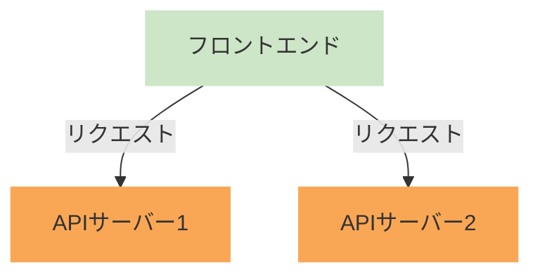
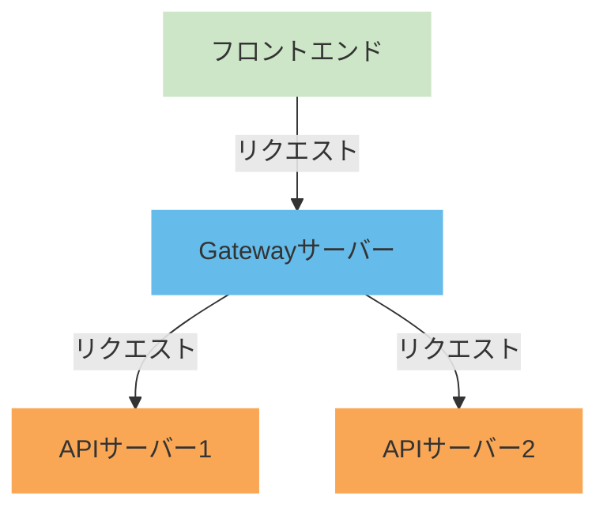
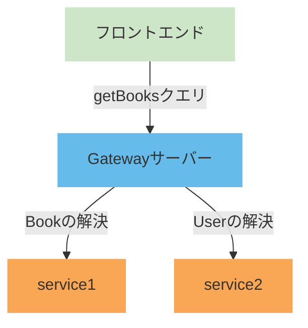

# はじめに
こんにちはたくみです．

「今年最も大きなチャレンジ」ということで，RestAPIからGraphQLの移行や，認証基盤システムのインフラ構築，AppRouterのContainer／Presentation構成の移行など様々思い浮かびますが，一番困難だったのは「Graphql Federation」の検証かなと思います．
ただ，Graphql Federationを理解すると，今までのGraphQLには戻れない体になってしまい，マイクロサービスアーキテクチャの虜になってしまいました笑

この記事では実際に検証したときの手順と困難を紹介します．

誰かのお役に立てたら幸いです．

:::message
この記事では検証やデバッグの工程は省略しており，検証（導入）のまとめとなっています．
あと長いです．読み飛ばすなり，ほしい部分だけを読むなりしてください．
:::

# 環境
### 全体
- Node.js v18.18.0
- npm v9.8.1
### Gatewayサーバー
- express v4.17.2
- Apollo Server v4.11.0
- Apollo Gateway v2.7.8
### 各APIサーバー
- express v4.17.2
- Apollo Server v4.11.0

# 概要
### 従来
現在のSaaSプロダクトは，サービスごとに別れているマイクロサービスアーキテクチャとなっています．
しかし，APIサーバー（バックエンド）もサービスごとに別れてしまっており，サービス間のデータのやり取りで，複数のエンドポイントにリクエストを送っている感じになっていました．
:::details 従来のアーキテクチャ図（簡略）

:::

マイクロサービスアーキテクチャをしているなら，APIサーバーをまとめ上げたほうが，エンドポイントが１つになり，フロントエンドから見るととてもわかり易くなりそうですよね．
また，APIサーバーが別れていることから，複数のサービスからデータを取得してきて，それをフロントエンドで合体させて使用する形になっていました．
データの取得や変形は極力バックエンドに任せたいところなのですが，サーバーが別れているためどうしようにもありませんでした…

### GraphQL Federation
ここで出てきたのが「GraphQL Federation」という技術です．
GraphQL Federationは，Gatewayサーバーを用意しておき，フロントエンドからはGatewayサーバーのエンドポイントを叩くことで，Gatewayサーバーがバックエンドにリクエストを伝搬してデータを返してくれると言ったものになります．
また，それだけでなく，クエリによって各サービスのデータを合体させて返すため，フロントエンド側での処理も少なくなります！
:::details GraphQL Federationのアーキテクチャ図（簡略）

:::

この技術を使用すれば，従来の困っていた点を解決させることができるため，導入の流れになりました．

https://www.apollographql.com/docs/graphos/schema-design/federated-schemas/federation

# 構築の流れ（手順）
## 1. 各APIサーバーの準備
### 1-1．APIサーバーのGraphQL化
今までのAPIサーバーでは，GraphQLで作成されているものとREST APIで作成されているものが混ざり合っていました．
このままでは，GraphQL Federationを導入することができないため，まずはAPIサーバーをGraphQL化する必要があります．
ここのGraphQL化は，使用している言語やフレームワークによって異なるので，それぞれの公式ドキュメントを参考にしてください．
### ex） Express.js
https://graphql.org/graphql-js/running-an-express-graphql-server/
### ex） NestJS
https://docs.nestjs.com/graphql/quick-start

### 1-2．APIサーバーのFederation対応
APIサーバーをGraphQL化したら，次にFederationに対応させるようコードを修正します．
これも各フレームワークによって異なりますが，Apollo Serverを使用している場合は，以下のように修正します．
:::details コード例
```ts:index.ts
import http from "http";

import { gql } from "graphql-tag";
import { buildSubgraphSchema } from "@apollo/subgraph";
import { ApolloServer } from "@apollo/server";
import { expressMiddleware } from "@apollo/server/express4";
import { ApolloServerPluginDrainHttpServer } from "@apollo/server/plugin/drainHttpServer";
import cors from "cors";
import express from "express";

const app = express();
const httpServer = http.createServer(app);

const typeDefs = gql`
    type Query {
        hello: String!
    }
`;

const resolvers = {
    Query: {
        hello: () => "Hello, World!",
    },
};

const server = new ApolloServer({
    schema: buildSubgraphSchema([
        {
            typeDefs,
            resolvers,
        },
    ]),
    plugins: [ApolloServerPluginDrainHttpServer({ httpServer })],
});

(async () => {
    await server.start();

    app.use(
        "/graphql",
        cors<cors.CorsRequest>();
        express.json(),
        expressMiddleware(server, {
            context: async ({ req }) => {
                return { headers: req.headers };
            },
        })
    );

    await new Promise<void>((resolve) => httpServer.listen({ port: 4000 }, resolve));
    console.log("Server ready at 4000 port");
})();
```
:::

## 2. GraphQL Federation Gatewayサーバーの作成
すべてのAPIサーバーをGraphQL化したら，早速Federation用のGatewayサーバーを作成します．
ここで，GatewayサーバーはApollo ServerとApollo Gatewayを使用しました．
https://www.apollographql.com/docs/apollo-server
https://www.apollographql.com/docs/federation/v1/gateway

### 2-1. 各モジュールのインストール
```bash
npm install @apollo/server @apollo/gateway express cors http
npm install -D nodemon ts-node
```

### 2-2．index.tsの作成
`index.ts`にGatewayサーバーを実装していきます．
:::details コード例
```typescript:./src/index.ts
import http from "http";

import { ApolloGateway, IntrospectAndCompose } from "@apollo/gateway";
import { ApolloServer } from "@apollo/server";
import { expressMiddleware } from "@apollo/server/express4";
import { ApolloServerPluginDrainHttpServer } from "@apollo/server/plugin/drainHttpServer";
import cors from "cors";
import express from "express";

const app = express();
const httpServer = http.createServer(app);

const serviceList = [
    { name: "service1", url: "http://localhost:4001/graphql" },
    { name: "service2", url: "http://localhost:4002/graphql" },
];

const gateway = new ApolloGateway({
    supergraphSdl: IntrospectAndCompose({
        serviceList,
    }),
})

const server = new ApolloServer({
    gateway,
    plugins: [ApolloServerPluginDrainHttpServer({ httpServer })],
});

(async () => {
    await server.start();

    app.use(
        "/graphql",
        cors<cors.CorsRequest>();
        express.json(),
        expressMiddleware(server, {
            context: async ({ req }) => {
                return { headers: req.headers };
            },
        })
    );

    await new Promise<void>((resolve) => httpServer.listen({ port: 4000 }, resolve));
    console.log("Server ready at 4000 port");
})();
```
:::

### 2-3. Gatewayサーバーの起動
`index.ts`が完成したら実際に動かしてみましょう．
Express.jsを使用しているため、nodemonで動かしています．
なお，Gatewayサーバー起動の際は各APIサーバーも起動しておいてください．
```bash
npx nodemon index.ts
```

:::details 各APIサーバーも起動する理由
ここで下記のようなエラーが発生する場合があります．
```bash
Service definition for service service1 is missing a url
/workspace/node_modules/@apollo/gateway/src/supergraphManagers/IntrospectAndCompose/loadServicesFromRemoteEndpoint.ts:32
const promiseOfServiceList = serviceList.map(async ({ name, url, datasource }) => {

Error: Tried to load schema for 'Service1' but no 'url' was specified.
```

エラーが出ても焦らないでください．よく読めばわかります．
`service definition is missing a url`と出ているので，service1に対するurlが見つからないと言われていることがわかります．

実はGatewayサーバーは，**スーパーグラフ**（すべてのGraphQLのスキーマを統合したスキーマ）を作成するために，起動時に各APIサーバーへリクエストを送ります．
しかし，現在，`https://localhost:4001/graphql`は起動されていないので，Gatewayサーバーはリクエストを送ることができません．

このエラーが出た場合は，各APIサーバーを起動してからGatewayサーバーを起動してください．
:::

# 3．動作確認
実は，ここまででGraphQL Federationの導入は完了しています．
Gatewayサーバーのエンドポイントにリクエストを送ることで，各APIサーバーのデータを取得することができます．
```bash:リクエスト
curl --request POST \
  --header 'content-type: application/json' \
  --url 'http://localhost:4000/graphql' \
  --data '{"query":"query { hello }"}'
```

```bash:レスポンス
{
  "data": {
    "hello": "Hello, World!"
  }
}
```

# 4. サービス間のデータのやり取り
ここまででGraphQL Federationの導入は完了しましたが，サービス間のデータのやり取りができるよう各APIサーバーのスキーマやリゾルバーを修正します．
## 4-1．具体例
具体例があったほうがわかりやすいので，次のようなアーキテクチャを考えてみます．
- service1：本の情報を提供するAPIサーバー
- service2：ユーザーの情報を提供するAPIサーバー
```graphql:service1のスキーマ
type Book {
    id: ID!
    title: String!
    author: User!
}

query {
    getBooks: [Book]!
}
```
```graphql:service2のスキーマ
type User {
    id: ID!
    name: String!
}
```


## 4-2．スキーマの修正
まずは設計図であるスキーマの修正をしながら具体例を整理していきましょう．
### 4-2-1．service1のスキーマ
service1のスキーマは以下の通りとなります．
```graphql:service1のスキーマ
type Book {
    id: ID!
    title: String!
}

query {
    getBooks: [Book]!
}
```
あれ？`author`がないと思った方もいると思います．
service1のスキーマには`author`がないのは，`author`はservice2でしか解決できない（データを持っていない）フィールドなので，service1のスキーマには含めずません．

### 4-2-2．service2のスキーマ
service2のスキーマは以下の通りとなります．
```graphql:service2のスキーマ
type User @key(fields: "id") {
    id: ID!
    name: String!
}

extend type Book @key(fields: "id") {
    id: ID! @external
    author: User!
}
```
ここで，`author`が出てきました！純正のGraphQLでは使われない`@key`や`@external`が出てきましたが，これはFederationのためのディレクティブです．
#### `@key`：この型が他の型と関連付けられるキーを指定します．
  DBでいうところの主キーにあたいするフィールドになります．
  ここで指定したフィールドをキーとして，外部から参照できるようになります．
#### `extend type`：外部の型を拡張するためのディレクティブです．
  他のサービスで解決される型を拡張し，新たなフィールドを追加することができます．
#### `@external`：他のサービスから解決されるフィールドを指定します．
  ここで指定したフィールドは，他のサービスから取得されるデータを使用することができます．
  このフィールドは後々，リゾルバーで使用することになります．
