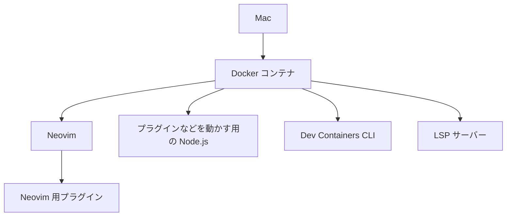

# はじめに
最近、大学生というブランドがもう少しという事実に気付き、悲しんでいるたくみです。
まず皆さんに問い掛けたい。 VSCode 重くないですか？？？

そんな理由から、VSCode から Neovim へ移行したい！
のですが Neovim は `GitHub Copilot` や `LSP` などのプラグインで `Node.js` が必要になります。
しかし、実は私 Mac には `Node.js` や `Python` （デフォルト以外）は入れたくないという思想の持ち主なのです。
ということで、 Neovim さんと私の思想の全面戦争が勃発しています。
一緒に戦っていただける方をこの記事で見つけられればなと思っています。

# 背景
今まで私は、 VSCode の Neovim 拡張機能を利用して開発を行っていました。理由としては、 IDE の良いところを利用しながら Neovim を使えるためです。
しかし、最近の Neovim 拡張機能は、 OSC 52 に対応してなかったり（おそらく設定してないだけだと思いますが）、たまにキーが効かなくなったり、Neovim のプラグインを上手いこと使えなかったりと色々不便な部分が見えてきました。
また、 VSCode 自体も重く、サーバーを複数起動した時に落ちたり、よくローディング状態になってしまいます。
これらの理由から、 VsCode ではなく Neovim を使うようにしようかなと考え始めました。

# 問題
さてここで様々な問題が発生しました。
「はじめに」でも取り上げましたが、 `GitHub Copilot` や `LSP` などのプラグインでは、 `Node.js` や対応する LSP サーバーを用意する必要があります。
大人しくこれらの環境を Mac に入れればすんなり解決はしますが、 Mac の中身を汚したくないという思想のもとそれは受け付けません。

# 解決策
Gemini や Claude に話を聞いてもらったところ、 「Docker で Neovim を使えば良いのではないか」という発想に至りました。
Docker を挟むことで Neovim の良さである速度が落ちるということは重々承知ですが、 Neovim への気持ちがあれば無視できるものとしています。
LSP は `lsp-containers` というプラグインがありますが、対応していない LSP サーバーが存在したり他のプラグインで`Node.js`などが必要になることも考え、この手法を採用しています。

## 大まかな全体像
大まかな全体像は次の通りです。


## Docker コンテナで必要な設定
おそらく最近の家庭では、一家に一台 `Docker` があると思います。
この記事では、起動を簡単にするために `Docker Compose` プラグインも使用しています。

まず `Dockerfile` を作成します。
```Dockerfile:Dockerfile
# Debian ベースを使用。Alpine だと Mason でつまづく。
FROM debian:bookworm-slim

# 依存パッケージのインストール。
RUN apt-get update && apt-get install -y --no-install-recommends \
  curl \
  bash \
  build-essential \
  git \
  openssh-client \
  # picker などの Fuzzy Finder の Grep を使用するために入れておく。
  ripgrep \
  xclip \
  unzip \
  ca-certificates \
  # Dev Containers CLI を使用するため、 docker.io を入れておく。
  docker.io \
  gnupg \
  && rm -rf /var/lib/apt/lists/*

# Docker Compose のインストール。
RUN install -m 0755 -d /etc/apt/keyrings \
  && curl -fsSL https://download.docker.com/linux/debian/gpg | gpg --dearmor -o /etc/apt/keyrings/docker.gpg \
  && chmod a+r /etc/apt/keyrings/docker.gpg \
  && echo "deb [arch=$(dpkg --print-architecture) signed-by=/etc/apt/keyrings/docker.gpg] https://download.docker.com/linux/debian $(. /etc/os-release && echo $VERSION_CODENAME) stable" \
  | tee /etc/apt/sources.list.d/docker.list > /dev/null \
  && apt-get update -y \
  && apt-get install -y docker-ce-cli

# Node.js のインストール。
RUN curl -fsSL https://deb.nodesource.com/setup_current.x | bash - \
  && apt-get install -y --no-install-recommends nodejs \
  && rm -rf /var/lib/apt/lists/*

# Neovim のインストール。
RUN curl -LO https://github.com/neovim/neovim/releases/latest/download/nvim-linux-arm64.tar.gz \
  && tar xzf nvim-linux-arm64.tar.gz -C /opt \
  && ln -s /opt/nvim-linux-arm64/bin/nvim /usr/local/bin/nvim \
  && rm nvim-linux-arm64.tar.gz

# lazygit のインストール。
RUN LAZYGIT_VERSION=$(curl -s https://api.github.com/repos/jesseduffield/lazygit/releases/latest | grep '"tag_name":' | sed 's/.*"v\([^"]*\)".*/\1/') \
  && curl -Lo lazygit.tar.gz "https://github.com/jesseduffield/lazygit/releases/latest/download/lazygit_${LAZYGIT_VERSION}_Linux_arm64.tar.gz" \
  && tar xzf lazygit.tar.gz lazygit \
  && install lazygit /usr/local/bin \
  && rm lazygit lazygit.tar.gz

# Claude Code，Dev Containers CLI のインストール。
RUN npm install -g @anthropic-ai/claude-code @devcontainers/cli

# Dev Containers CLI 用の alias を設定。
RUN echo "alias dc='devcontainer up --workspace-folder . && devcontainer exec bash'" >> /root/.bashrc

# GitHub の SSH ホストキーを事前登録。Docker 内で GitHub の操作を行うため。
RUN mkdir -p /root/.ssh \
  && ssh-keyscan github.com >> /root/.ssh/known_hosts 2>/dev/null

ENV PATH="/root/.local/share/nvim/mason/bin:${PATH}"

CMD ["nvim", "+TSUpdate", "."]
```
ちゃっかり `Claude Code` や `Git` を入れているところがポイントです。
次に、この `Dockerfile` を使用する `docker-compose.yaml` を作成します。
```yaml:docker-compose.yaml
services:
  nvim:
    build: .
    # 作業用ディレクトリを Mac の環境と同じディレクトリにする。
    working_dir: ${TARGET_PATH}
    volumes:
      - ${TARGET_PATH}:${TARGET_PATH}
      # nvim の設定ファイルをボリュームづけする。
      - ~/Documents/dotfiles/nvim:/root/.config/nvim
      - ~/.local/share/docker-nvim:/root/.local/share/nvim
      - ~/.local/state/docker-nvim:/root/.local/state/nvim
      - ~/.cache/docker-nvim:/root/.cache/nvim
      - ~/.config/github-copilot:/root/.config/github-copilot
      # Git の設定を共有。
      - ~/.gitconfig:/root/.gitconfig:ro
      # SSH Agent の共有
      - /run/host-services/ssh-auth.sock:/run/host-services/ssh-auth.sock
      # Docker の共有。
      - /var/run/docker.sock:/var/run/docker.sock
    # SSH Agent の共有。
    environment:
      - SSH_AUTH_SOCK=/run/host-services/ssh-auth.sock
    stdin_open: true
    tty: true
```

## Docker を起動するスクリプトを作成
では作成した `docker-compose.yaml` を使用して Docker コンテナを起動するスクリプトを作成します。
```bash:.zshrc
function dnvim() {
  # 引数のパスをもらう。
  local input_path="${1:-.}"
  
  # 作業用パスを組み立てる。
  local target_path
  target_path=$(realpath "$input_path")

  # 先ほど作った Docker ファイルの場所。
  local config_dir="$HOME/Documents/dotfiles/nvim/docker"

  # 指定されたパスが存在しない時。
  if [ ! -d "$target_path" ] && [ ! -f "$target_path" ]; then
    echo "Error: Path '$target_path' does not exist."
    return 1
  fi

  # docker-compose を使用してコンテナの起動。
  TARGET_PATH="$target_path" docker compose \
    -f "$config_dir/docker-compose.yaml" \
    -p "nvim-env" \
    run \
    --rm nvim
}
```

これらの簡単な設定を行うことで、`dnvim パス`というコマンドで Neovim を開くことができます。
また、`Dev Containers CLI` もインストールしているため、`.devcontainers` が存在するプロジェクトでは、`devcontainer up` や `devcontainer exec コマンド` といったコマンドで使用することができます。

# まとめ
Macに環境を入れたくない私と、環境を入れざるを得ない状況を作ってくるNeovimとの格闘の物語でした。
今のところは勝利しています。対戦ありがとうございました。

では、良いNeovimライフを！
