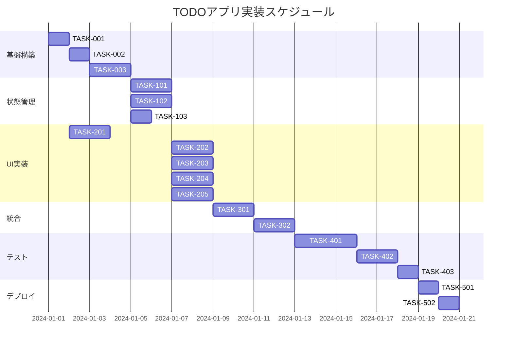

# はじめに
最近イベントに行くことが多く、東京いいなーと思いつつあるたくみです。

先日、クラスメソッド社からClaude Code向けフレームワーク「**Tsumiki**」がリリースされました。
https://classmethod.jp/news/20250729-tsumiki/
これまでClaude Codeには軽く触れる程度でしたが、フレームワークの登場を機に本格的に試してみることにしました。

# Tsumikiとは
Tsumikiとは、クラスメソッド社が公開したAIによる**テスト駆動開発、TDD**を支援するオープンソースフレームワークです。

# 背景
従来のAI駆動開発（Vibe Codingとも呼ばれます）では、AIと人間の間で厳密な要件定義を行わないため、期待通りの成果物が得られないケースがありました。
また、AIが自動でテストを作成するわけではないため、品質が保証されず本番環境での利用が難しいという課題も指摘されています。

Tsumikiは、こうした課題を解決するために、AIに**要件定義**から**TDD**までを実行させます。これにより、要件の曖昧さをなくし、テストによって品質が保証された開発を実現します。

:::message
ちなみに、AWS KiroとTsumikiの要件定義は同じようなことっぽいです。
https://aws.amazon.com/jp/blogs/news/introducing-kiro/
:::

# Tsumikiでできること
Tsumikiでは、AI開発におけるTDDを行うことができます。そのため、仕様、テスト、品質ファーストの品質が保証されたシステムを実現できます。

現在、Tsumikiでは主に以下のコマンドが提供されています。
- **Kairoコマンド**
    コマンドを対話形式で実行するだけで、要件定義、設計、タスク分割、TDDによる実装までを自動で行います。
- **TDDコマンド**
    TDDの各ステップ（Red-Green-Refactor）をAIが支援します。
- **Revコマンド**
    既存のコードを解析し、ドキュメントを生成するリバースエンジニアリングを行います。

# 使ってみた
では実際にTsumikiのKairoコマンドを使用してTodoアプリを作成してみました。

## インストール
Node.jsのパッケージマネージャーを使用してインストールします。
```bash
bunx tsumiki install
```
このコマンドを実行すると、`.claude/command`配下にTsumikiのコマンドがインストールされ、使用できるようになります。

## 要件定義
claude codeで以下のコマンドを入力することで要件定義が行われます。
```bash
/kairo-requirements
```
すると、AIが要件の概要について質問してきます。
```bash
・要件の概要を教えてください...
> タスク管理ができるTODOアプリを作成したい。
```

たったこれだけでTodoアプリに対する要件定義が行われます。

:::details 作成された要件定義
```md:docs/spec/todo-app-requirements.md
# TODOアプリ 要件定義書

## 概要

個人のタスク管理を効率化するためのTODOアプリケーション。ユーザーがタスクの作成、編集、削除、ステータス管理を直感的に行えるシステムを提供する。

## ユーザストーリー

### ストーリー1: タスク作成

- **である** 一般ユーザー **として**
- **私は** 新しいタスクを作成 **をしたい**
- **そうすることで** やるべきことを記録し、忘れることなく管理できる

### ストーリー2: タスク完了

- **である** 一般ユーザー **として**
- **私は** 完了したタスクにチェックマークを付ける **をしたい**
- **そうすることで** 進捗を可視化し、達成感を得られる

### ストーリー3: タスク編集

- **である** 一般ユーザー **として**
- **私は** 既存のタスクの内容を修正 **をしたい**
- **そうすることで** 状況の変化に応じてタスクを最新の状態に保てる

### ストーリー4: タスク削除

- **である** 一般ユーザー **として**
- **私は** 不要になったタスクを削除 **をしたい**
- **そうすることで** リストを整理し、重要なタスクに集中できる

### ストーリー5: タスク優先度管理

- **である** 一般ユーザー **として**
- **私は** タスクに優先度を設定 **をしたい**
- **そうすることで** 重要なタスクから順番に取り組める

## 機能要件（EARS記法）

### 通常要件

- REQ-001: システムはユーザーがタスクのタイトルを入力してタスクを作成できなければならない
- REQ-002: システムはタスクリストに作成されたタスクを表示しなければならない
- REQ-003: システムはユーザーがタスクの完了状態を切り替えできなければならない
- REQ-004: システムは完了したタスクを視覚的に区別して表示しなければならない
- REQ-005: システムはユーザーがタスクの内容を編集できなければならない
- REQ-006: システムはユーザーがタスクを削除できなければならない

### 条件付き要件

- REQ-101: タスクのタイトルが空の場合、システムはタスクの作成を拒否しなければならない
- REQ-102: タスクのタイトルが200文字を超える場合、システムは入力を制限しなければならない
- REQ-103: 削除確認が必要な設定の場合、システムは削除前に確認ダイアログを表示しなければならない
- REQ-104: タスクが編集モードの場合、システムは保存とキャンセルのオプションを提供しなければならない

### 状態要件

- REQ-201: タスクリストが空の状態にある場合、システムは「タスクがありません」というメッセージを表示しなければならない
- REQ-202: タスクが完了状態にある場合、システムはタスクのテキストに取り消し線を表示しなければならない
- REQ-203: アプリケーションが読み込み中の状態にある場合、システムはローディングインジケーターを表示しなければならない

### オプション要件

- REQ-301: システムはタスクに優先度（高、中、低）を設定してもよい
- REQ-302: システムはタスクに期限日を設定してもよい
- REQ-303: システムはタスクをカテゴリ別に分類してもよい
- REQ-304: システムは完了したタスクを自動的に非表示にしてもよい
- REQ-305: システはタスクの並び順をドラッグ&ドロップで変更できてもよい

### 制約要件

- REQ-401: システムは同時に最大1000個のタスクを管理できなければならない
- REQ-402: システムはブラウザのローカルストレージにデータを保存しなければならない
- REQ-403: システムはレスポンシブデザインでモバイルデバイスに対応しなければならない
- REQ-404: システムはキーボードナビゲーションに対応しなければならない

## 非機能要件

### パフォーマンス

- NFR-001: システムはタスクの作成・更新・削除操作を500ms以内に完了しなければならない
- NFR-002: システムは1000個のタスクを3秒以内に読み込み表示しなければならない
- NFR-003: システムは60fpsのスムーズなアニメーションを提供しなければならない

### ユーザビリティ

- NFR-201: システムは新規ユーザーが5分以内に基本操作を習得できるインターフェースを提供しなければならない
- NFR-202: システムはアクセシビリティガイドライン（WCAG 2.1 AA）に準拠しなければならない
- NFR-203: システムはタッチデバイスで最低44px×44pxのタップ領域を確保しなければならない

### 互換性

- NFR-301: システムはChrome、Firefox、Safari、Edgeの最新2バージョンで動作しなければならない
- NFR-302: システムはiOS Safari、Android Chromeで動作しなければならない

### 保守性

- NFR-401: システムはTypeScriptで型安全性を保証しなければならない
- NFR-402: システムはユニットテストのカバレッジ80%以上を維持しなければならない

## Edgeケース

### エラー処理

- EDGE-001: ローカルストレージが満杯の場合、システムはエラーメッセージを表示し、古いデータの削除を促す
- EDGE-002: ブラウザがローカルストレージをサポートしない場合、システムはセッションストレージを使用する
- EDGE-003: データの保存に失敗した場合、システムはユーザーに通知し、再試行のオプションを提供する

### 境界値

- EDGE-101: タスクタイトルが200文字丁度の場合、システムは正常に保存する
- EDGE-102: タスクが0個の場合、システムは適切な空状態を表示する
- EDGE-103: タスクが1000個に達した場合、システムは新規作成を制限し、警告メッセージを表示する

### 操作競合

- EDGE-201: 同じタスクを同時に編集しようとした場合、システムは最後の操作を優先する
- EDGE-202: 削除したタスクを同時に編集しようとした場合、システムは適切なエラーメッセージを表示する

### ネットワーク・ブラウザ異常

- EDGE-301: ブラウザタブが非アクティブになった場合、システムは編集中のデータを自動保存する
- EDGE-302: ページがリロードされた場合、システムは最後に保存された状態を復元する

## 受け入れ基準

### 機能テスト

- [ ] 新しいタスクを作成できる
- [ ] タスクの完了状態を切り替えできる
- [ ] タスクの内容を編集できる
- [ ] タスクを削除できる
- [ ] 空のタイトルでタスクを作成しようとすると拒否される
- [ ] 200文字を超えるタイトルは制限される
- [ ] 完了したタスクは視覚的に区別される
- [ ] タスクリストが空の場合、適切なメッセージが表示される

### 非機能テスト

- [ ] タスク操作が500ms以内に完了する
- [ ] 1000個のタスクが3秒以内に表示される
- [ ] モバイルデバイスで正常に動作する
- [ ] キーボード操作で全機能にアクセスできる
- [ ] 主要ブラウザで動作する
- [ ] アクセシビリティ要件を満たす

### Edgeケーステスト

- [ ] ローカルストレージ満杯時のエラー処理が適切
- [ ] データ保存失敗時のエラー処理が適切
- [ ] 1000個のタスク制限が正常に動作する
- [ ] ブラウザリロード後にデータが復元される
```
:::

生成された内容を確認し、問題がなければ次に進みます。修正が必要な場合は、この段階で手直しをします。

## 設計
次に設計を行うために次のコマンドを入力しまし。
```bash
/kairo-design
```

このコマンドだけで、AIが設計を行い、以下のファイル群が自動で作成されます。

- `api-design.md`
- `architecture.md`
- `dataflow.md`
- `interfaces.ts`
- `storage-schema.md`

:::message
流石に内容が長すぎるので省略します。GitHub公開してるので、そちらをみてください。
:::

## タスク分割
次にタスク分割を行います。
```bash
/kairo-tasks
```

このコマンドにより、実装タスクをまとめたtodo-app-tasks.mdが作成されます。
驚くべきことに、タスクの依存関係やクリティカルパスまで可視化されたガントチャートも含まれています。

:::details 作成されたタスク一覧
```md:todo-app-tasks.md
# TODOアプリ 実装タスク

## 概要

全タスク数: 18タスク
推定作業時間: 32-40時間
クリティカルパス: TASK-001 → TASK-002 → TASK-003 → TASK-101 → TASK-201 → TASK-202 → TASK-301

## タスク一覧

### フェーズ1: 基盤構築

#### TASK-001: プロジェクト初期設定

- [ ] **タスク完了**
- **タスクタイプ**: DIRECT
- **要件リンク**: NFR-401 (TypeScript型安全性)
- **依存タスク**: なし
- **実装詳細**:
  - Vite + React + TypeScriptプロジェクト作成
  - ESLint + Prettier設定
  - package.json依存関係設定
  - tsconfig.json設定
  - vite.config.tsセットアップ
- **テスト要件**:
  - [ ] プロジェクトビルドテスト
  - [ ] 型チェック実行テスト
  - [ ] Lint実行テスト
- **完了条件**:
  - [ ] `npm run dev`でサーバーが起動する
  - [ ] `npm run build`でビルドが成功する
  - [ ] `npm run type-check`でエラーがない

#### TASK-002: 型定義とインターフェース実装

- [ ] **タスク完了**
- **タスクタイプ**: DIRECT
- **要件リンク**: NFR-401, REQ-001-006
- **依存タスク**: TASK-001
- **実装詳細**:
  - `src/types/index.ts`に型定義実装
  - Task, UserPreferences, AppStateインターフェース
  - ActionType, FormState等の関連型
  - デフォルト値と定数の定義
- **テスト要件**:
  - [ ] 型定義の構文チェック
  - [ ] 型の互換性テスト
- **完了条件**:
  - [ ] 全インターフェースが定義されている
  - [ ] TypeScriptコンパイルエラーがない
  - [ ] デフォルト値が適切に設定されている

#### TASK-003: ストレージサービス実装

- [ ] **タスク完了**
- **タスクタイプ**: TDD
- **要件リンク**: REQ-402 (ローカルストレージ使用), EDGE-001-003
- **依存タスク**: TASK-002
- **実装詳細**:
  - `src/services/StorageService.ts`実装
  - localStorage/sessionStorageフォールバック
  - データ暗号化/復号化機能
  - バージョン管理とマイグレーション
  - エラーハンドリング（容量超過等）
- **テスト要件**:
  - [ ] 単体テスト: CRUD操作
  - [ ] 単体テスト: エラーハンドリング
  - [ ] 単体テスト: フォールバック動作
  - [ ] 統合テスト: データ永続化
- **エラーハンドリング**:
  - [ ] ストレージ容量超過時の処理
  - [ ] データ破損時の復旧処理
  - [ ] ブラウザサポート確認

### フェーズ2: 状態管理とビジネスロジック

#### TASK-101: タスク状態管理実装

- [ ] **タスク完了**
- **タスクタイプ**: TDD
- **要件リンク**: REQ-001-006, REQ-101-104
- **依存タスク**: TASK-003
- **実装詳細**:
  - `src/contexts/TaskContext.tsx`実装
  - `src/reducers/taskReducer.ts`実装
  - タスクCRUD操作のアクション定義
  - 状態の正規化とインデックス管理
- **テスト要件**:
  - [ ] 単体テスト: Reducerロジック
  - [ ] 単体テスト: アクションクリエーター
  - [ ] 統合テスト: Context Provider
- **エラーハンドリング**:
  - [ ] 無効なアクションの処理
  - [ ] 状態の整合性チェック

#### TASK-102: タスクリポジトリ実装

- [ ] **タスク完了**
- **タスクタイプ**: TDD
- **要件リンク**: REQ-001-006, REQ-401 (最大1000タスク)
- **依存タスク**: TASK-003
- **実装詳細**:
  - `src/repositories/TaskRepository.ts`実装
  - タスクCRUD操作
  - フィルタリング・ソート機能
  - ページネーション対応
  - 検索機能実装
- **テスト要件**:
  - [ ] 単体テスト: CRUD操作
  - [ ] 単体テスト: フィルタリング
  - [ ] 単体テスト: 検索機能
  - [ ] パフォーマンステスト: 1000タスク処理
- **パフォーマンス要件**:
  - [ ] 1000タスクを3秒以内に処理 (NFR-002)

#### TASK-103: アプリケーション設定管理

- [ ] **タスク完了**
- **タスクタイプ**: TDD
- **要件リンク**: ユーザー設定関連要件
- **依存タスク**: TASK-003
- **実装詳細**:
  - `src/contexts/PreferencesContext.tsx`実装
  - ユーザー設定の保存・復元
  - デフォルト設定の管理
  - 設定の検証とマイグレーション
- **テスト要件**:
  - [ ] 単体テスト: 設定の保存・復元
  - [ ] 単体テスト: デフォルト値の適用
  - [ ] 統合テスト: 設定変更の反映

### フェーズ3: UIコンポーネント実装

#### TASK-201: 基本UIコンポーネント

- [ ] **タスク完了**
- **タスクタイプ**: TDD
- **要件リンク**: NFR-201-203 (ユーザビリティ)
- **依存タスク**: TASK-001
- **実装詳細**:
  - `src/components/common/`ディレクトリ作成
  - Button, Input, Modal, LoadingSpinner実装
  - CSS Modules設定とベーススタイル
  - アクセシビリティ対応 (ARIA属性)
- **UI/UX要件**:
  - [ ] レスポンシブデザイン (320px-1920px)
  - [ ] 44px以上のタップターゲット (NFR-203)
  - [ ] アクセシビリティ: WCAG 2.1 AA準拠 (NFR-202)
  - [ ] キーボードナビゲーション (REQ-404)
- **テスト要件**:
  - [ ] コンポーネントテスト (React Testing Library)
  - [ ] アクセシビリティテスト
  - [ ] レスポンシブテスト

#### TASK-202: TaskListコンポーネント

- [ ] **タスク完了**
- **タスクタイプ**: TDD
- **要件リンク**: REQ-002, REQ-004, REQ-201-202
- **依存タスク**: TASK-101, TASK-201
- **実装詳細**:
  - `src/components/TaskList/TaskList.tsx`実装
  - 仮想スクロール対応 (React Window)
  - フィルタリング・ソート機能
  - 空状態の表示
  - ローディング状態の管理
- **UI/UX要件**:
  - [ ] ローディング状態: スケルトンUI表示
  - [ ] 空状態: 「タスクがありません」メッセージ (REQ-201)
  - [ ] 完了タスクの視覚的区別 (REQ-202)
  - [ ] スムーズなアニメーション (60fps, NFR-003)
- **テスト要件**:
  - [ ] コンポーネントテスト: 表示・フィルタリング
  - [ ] パフォーマンステスト: 1000タスク表示
  - [ ] E2Eテスト: ユーザーインタラクション
- **パフォーマンス要件**:
  - [ ] 1000タスクを3秒以内に表示 (NFR-002)

#### TASK-203: TaskItemコンポーネント

- [ ] **タスク完了**
- **タスクタイプ**: TDD
- **要件リンク**: REQ-003, REQ-005, REQ-006, REQ-104
- **依存タスク**: TASK-101, TASK-201
- **実装詳細**:
  - `src/components/TaskItem/TaskItem.tsx`実装
  - インライン編集機能
  - チェックボックスによる完了切り替え
  - 削除確認ダイアログ
  - 優先度・カテゴリ表示
- **UI/UX要件**:
  - [ ] 編集モード: 保存・キャンセルボタン (REQ-104)
  - [ ] 完了状態: 取り消し線表示 (REQ-202)
  - [ ] 削除確認: モーダルダイアログ (REQ-103)
  - [ ] アニメーション: 完了時のフェードアウト
- **テスト要件**:
  - [ ] コンポーネントテスト: 編集・削除・完了切り替え
  - [ ] ユーザビリティテスト: 5分以内の操作習得 (NFR-201)
- **パフォーマンス要件**:
  - [ ] 操作レスポンス500ms以内 (NFR-001)

#### TASK-204: TaskFormコンポーネント

- [ ] **タスク完了**
- **タスクタイプ**: TDD
- **要件リンク**: REQ-001, REQ-101-102
- **依存タスク**: TASK-101, TASK-201
- **実装詳細**:
  - `src/components/TaskForm/TaskForm.tsx`実装
  - フォームバリデーション
  - リアルタイム文字数表示
  - 優先度・カテゴリ選択
  - 期限日設定
- **UI/UX要件**:
  - [ ] バリデーション: リアルタイムエラー表示
  - [ ] 文字数制限: 200文字上限表示 (REQ-102)
  - [ ] 必須フィールド: 視覚的表示
  - [ ] 送信中状態: ボタン無効化とスピナー
- **テスト要件**:
  - [ ] コンポーネントテスト: バリデーション
  - [ ] E2Eテスト: タスク作成フロー
- **エラーハンドリング**:
  - [ ] 空タイトルでの作成拒否 (REQ-101)
  - [ ] 文字数超過時の制限 (REQ-102)

#### TASK-205: FilterBarコンポーネント

- [ ] **タスク完了**
- **タスクタイプ**: TDD
- **要件リンク**: REQ-301-305 (オプション要件)
- **依存タスク**: TASK-101, TASK-201
- **実装詳細**:
  - `src/components/FilterBar/FilterBar.tsx`実装
  - ステータス・優先度・カテゴリフィルター
  - ソート機能 (作成日、更新日、タイトル、優先度)
  - 検索機能
  - フィルタークリア機能
- **UI/UX要件**:
  - [ ] 検索: インクリメンタルサーチ
  - [ ] フィルター: チップ形式で表示
  - [ ] ソート: 昇順・降順切り替え
  - [ ] レスポンシビリティ: モバイル対応
- **テスト要件**:
  - [ ] コンポーネントテスト: フィルタリング・検索
  - [ ] パフォーマンステスト: 検索速度

### フェーズ4: メインアプリケーション統合

#### TASK-301: Appコンポーネント統合

- [ ] **タスク完了**
- **タスクタイプ**: TDD
- **要件リンク**: 全体統合要件
- **依存タスク**: TASK-202, TASK-203, TASK-204, TASK-205
- **実装詳細**:
  - `src/App.tsx`メインコンポーネント実装
  - Context Providersの設定
  - エラーバウンダリの実装
  - グローバルスタイルの適用
  - ルーティング設定（将来拡張用）
- **UI/UX要件**:
  - [ ] エラーバウンダリ: ユーザーフレンドリーなエラー表示
  - [ ] 初期ロード: ローディング画面 (REQ-203)
  - [ ] レイアウト: レスポンシブグリッド
- **テスト要件**:
  - [ ] 統合テスト: 全体のデータフロー
  - [ ] E2Eテスト: 主要ユーザーシナリオ

#### TASK-302: パフォーマンス最適化

- [ ] **タスク完了**
- **タスクタイプ**: TDD
- **要件リンク**: NFR-001-003 (パフォーマンス要件)
- **依存タスク**: TASK-301
- **実装詳細**:
  - React.memo、useMemo、useCallbackの適用
  - コード分割とlazy loading
  - バンドルサイズ最適化
  - 仮想スクロールの最適化
- **パフォーマンス要件**:
  - [ ] 初期ロード2秒以内
  - [ ] タスク操作500ms以内 (NFR-001)
  - [ ] 1000タスク表示3秒以内 (NFR-002)
  - [ ] 60fpsアニメーション (NFR-003)
- **テスト要件**:
  - [ ] パフォーマンステスト: 各種操作の測定
  - [ ] メモリリークテスト
  - [ ] バンドルサイズ分析

### フェーズ5: テストとQA

#### TASK-401: ユニットテスト実装

- [ ] **タスク完了**
- **タスクタイプ**: TDD
- **要件リンク**: NFR-402 (テストカバレッジ80%以上)
- **依存タスク**: TASK-302
- **実装詳細**:
  - Jest + React Testing Libraryテスト実装
  - 全コンポーネントのテスト
  - ユーティリティ関数のテスト
  - カスタムフックのテスト
- **テスト要件**:
  - [ ] コンポーネントテスト: 全UIコンポーネント
  - [ ] ユニットテスト: ビジネスロジック
  - [ ] テストカバレッジ: 80%以上 (NFR-402)
- **完了条件**:
  - [ ] `npm run test`で全テストが通る
  - [ ] カバレッジレポートが80%以上

#### TASK-402: E2Eテスト実装

- [ ] **タスク完了**
- **タスクタイプ**: TDD
- **要件リンク**: 全受け入れ基準
- **依存タスク**: TASK-401
- **実装詳細**:
  - Playwright E2Eテストセットアップ
  - 主要ユーザーシナリオのテスト
  - クロスブラウザテスト対応
  - モバイル表示テスト
- **テスト要件**:
  - [ ] E2Eテスト: タスクCRUD操作
  - [ ] E2Eテスト: フィルタリング・検索
  - [ ] ブラウザテスト: Chrome, Firefox, Safari, Edge (NFR-301)
  - [ ] モバイルテスト: iOS Safari, Android Chrome (NFR-302)
- **完了条件**:
  - [ ] 全受け入れ基準がテストでカバーされている
  - [ ] 主要ブラウザで動作確認済み

#### TASK-403: アクセシビリティテスト

- [ ] **タスク完了**
- **タスクタイプ**: TDD
- **要件リンク**: NFR-202 (WCAG 2.1 AA準拠), REQ-404 (キーボードナビ)
- **依存タスク**: TASK-402
- **実装詳細**:
  - axe-coreを使用したアクセシビリティテスト
  - キーボードナビゲーションテスト
  - スクリーンリーダーテスト
  - コントラスト比チェック
- **テスト要件**:
  - [ ] アクセシビリティテスト: WCAG 2.1 AA準拠
  - [ ] キーボードテスト: Tab、Enter、Escape操作
  - [ ] スクリーンリーダーテスト: 音声読み上げ確認
- **完了条件**:
  - [ ] axe-core違反0件
  - [ ] キーボードで全機能アクセス可能

### フェーズ6: デプロイとドキュメント

#### TASK-501: プロダクションビルド設定

- [ ] **タスク完了**
- **タスクタイプ**: DIRECT
- **要件リンク**: 本番環境要件
- **依存タスク**: TASK-403
- **実装詳細**:
  - Viteプロダクションビルド設定
  - 環境変数設定
  - PWA対応 (Service Worker)
  - セキュリティヘッダー設定
- **テスト要件**:
  - [ ] プロダクションビルドテスト
  - [ ] PWA機能テスト
- **完了条件**:
  - [ ] `npm run build`でエラーなし
  - [ ] PWAとしてインストール可能

#### TASK-502: ドキュメント作成

- [ ] **タスク完了** 
- **タスクタイプ**: DIRECT
- **要件リンク**: 保守性要件
- **依存タスク**: TASK-501
- **実装詳細**:
  - README.mdの作成
  - 開発者向けドキュメント
  - APIドキュメント（内部API）
  - トラブルシューティングガイド
- **完了条件**:
  - [ ] セットアップ手順が記載されている
  - [ ] 開発者が5分以内に環境構築できる

## 実行順序



## マイルストーン

### マイルストーン1: 基盤完成 (TASK-001~003)
- React + TypeScript環境構築完了
- 型定義とストレージ基盤完成
- **成果物**: 開発環境、型定義、ストレージサービス

### マイルストーン2: コア機能完成 (TASK-101~103)
- 状態管理とビジネスロジック完成
- データの永続化機能完成
- **成果物**: TaskContext、TaskRepository、設定管理

### マイルストーン3: UI完成 (TASK-201~205)
- 全UIコンポーネント実装完了
- ユーザーインタラクション完成
- **成果物**: TaskList、TaskItem、TaskForm、FilterBar

### マイルストーン4: 統合完成 (TASK-301~302)
- アプリケーション統合完了
- パフォーマンス最適化完了
- **成果物**: 完全動作するTODOアプリ

### マイルストーン5: QA完成 (TASK-401~403)
- 全テスト実装完了
- 品質保証完了
- **成果物**: テストスイート、品質レポート

### マイルストーン6: リリース準備完了 (TASK-501~502)
- プロダクション環境対応完了
- ドキュメント整備完了
- **成果物**: デプロイ可能なアプリケーション

## 並行実行可能なタスク

1. **TASK-102, TASK-103** (状態管理層)
2. **TASK-202, TASK-203, TASK-204, TASK-205** (UIコンポーネント群)
3. **TASK-401, TASK-402** (テスト実装)

## クリティカルパス

**TASK-001** → **TASK-002** → **TASK-003** → **TASK-101** → **TASK-202** → **TASK-301** → **TASK-302** → **TASK-401** → **TASK-402** → **TASK-403** → **TASK-501** → **TASK-502**

このパスは**24-26日**で、全体工程の**75%**を占めます。
```
:::

## 実装
では実際にTDDで（AIが）実装していきます。
```bash
/kairo-implement
```

これで実装が終わり、Todoアプリが起動できます！
今回はフロントエンドとして`Vite`が使用されていそうです。

# 注意点
`/kairo-implements`の途中でClaude Codeが落ちると再開できなくなる？
再開の仕方がわかりませんでした...

# 最後に
Tsumikiを触って、とてつもないAIの進化を再度、実感しました。
これ使えば本番用でも一つのプロダクトをAI主導で作成できそうです。
なんなら、要件定義や設計、タスク分割の部分のみ使用して、**上流過程の支援**として使用することもできそうです。
Tsumikiはこれだけでなく、リバースエンジニアリングなどができるので、今後もっと触ってみたいです。

今回作成されたコードは以下のGitHubで公開しています。
気になったらみてみてください。
https://github.com/taku-271/tsumiki-learning

# 参考
https://github.com/classmethod/tsumiki